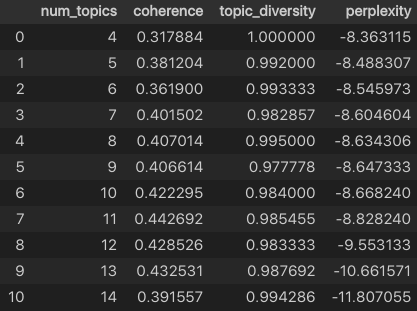

# Project Description

This project aims to evaluate the impact of social media features on the success of crowdfunding projects. The success is measured based on the number of backers, the ratio of the amount raised to the goal amount, and the overall project outcome.

The project evaluates the impact of likes, shares, and other features on project success. It also examines the influence of inherent social media post characteristics on project engagement.

The study assumes that the model explanations align with human understanding of feature impact on project success.

## Data

The project uses data from social media posts of crowdfunding projects, specifically from Facebook. This choice is due to the platform's popularity.

Note: The project can be extended to further study how different social media characteristics impact project success and engagement.

## Files

The project contains the following files:

The Data Folder is the place where all the EDA and data processing is done. It is further divided into the following subfolders:

## Modelling

### Latent Dirchlet Allocation

The project uses Latent Dirchlet Allocation (LDA) to extract topics from the text of the social media posts. The topics are then used as features in the model. The Metrics considered for the LDA model are:

* Coherence Score
* Log-Perplexity Score
* Topic Diversity

The following are the scores recorded for the varying number of topics:

### Modelling Approach

The project uses a two-step modelling approach. The first step is to generate a baseline metrics using a customized version of LazyPredict. The second step is to use the baseline metrics to select the best performing models and tune them further using GridSearchCV.

For the engagement prediction model, the following are the baseline metrics:

After further fine-tuning, the following are the metrics for the best performing model for engagement prediction(`HistGradientBoostingRegressor`):

